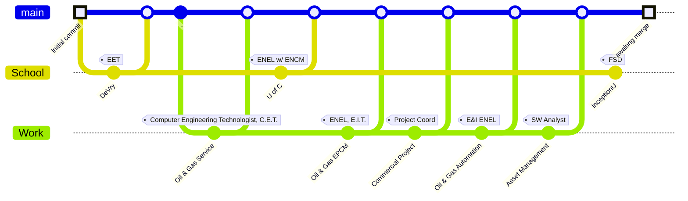

```mermaid
%% version1- initial draft (About me, to tell the personal story)

gitGraph
   commit id: "Initial commit" type: HIGHLIGHT
   
   branch School
   checkout School   
   commit id: "DeVry" tag: "EET"
   
   checkout main
   merge School
   commit id: " ."

   branch Work
   checkout Work
   commit id: "Oil & Gas Service" tag: "Computer Engineering Technologist, C.E.T."
   checkout main
   merge Work

   checkout School
   commit id: "U of C" tag: "ENEL w/ ENCM"

   checkout main
   merge School

   checkout "Work"
   commit id: "Oil & Gas EPCM" tag: "ENEL, E.I.T."
   checkout main
   merge Work

   checkout Work
   commit id: "Commercial Project" tag: "Project Coord"
   checkout main
   merge Work

   checkout Work
   commit id: "Oil & Gas Automation" tag: "E&I ENEL"
   checkout main
   merge Work
   
   checkout Work
   commit id: "Asset Management" tag: "SW Analyst"
   checkout main
   merge Work
   
   checkout School
   commit id: "InceptionU" tag: "FSD"
   checkout main
   commit id: "awaiting merge" type: HIGHLIGHT
   
``` 